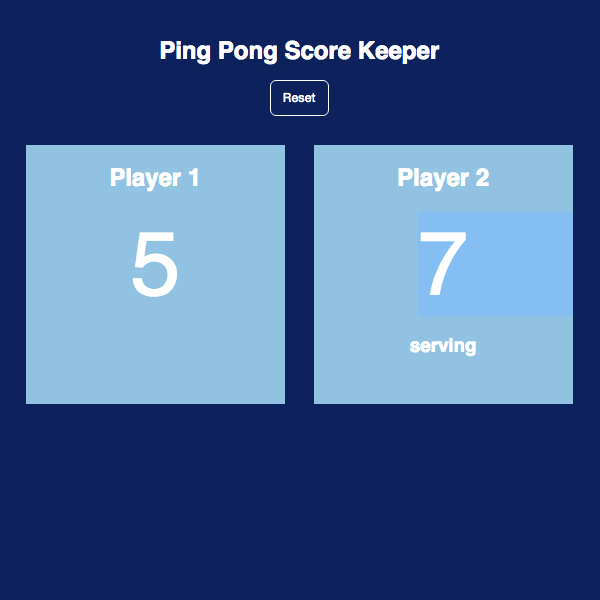
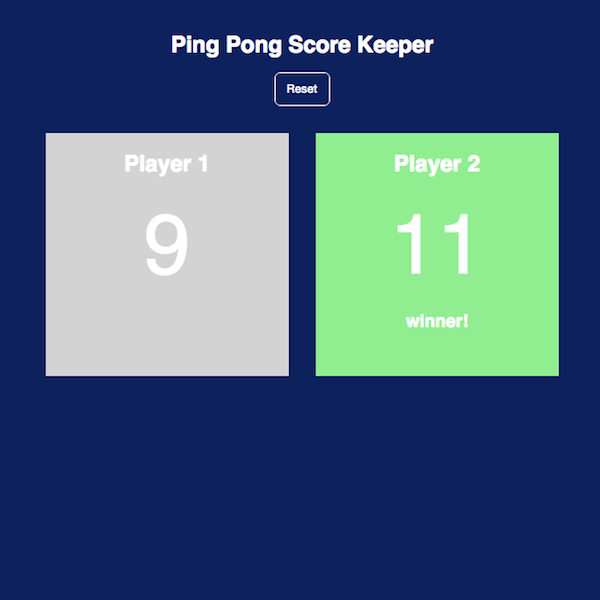

# ping-pong
This is a ping pong score keeper made with Angular.js, an MVVM architecture. 

It was quick and easy to make with one controller, one div, and a few logical directives. 

Play with it live here: http://jennyknuth.github.io/ping-pong/

